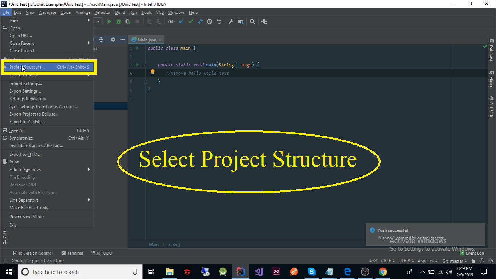
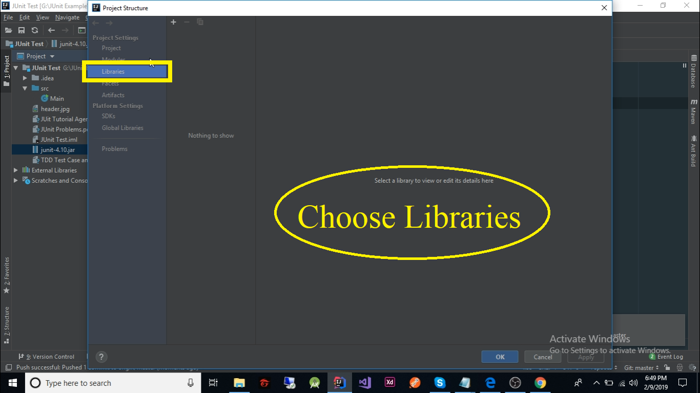
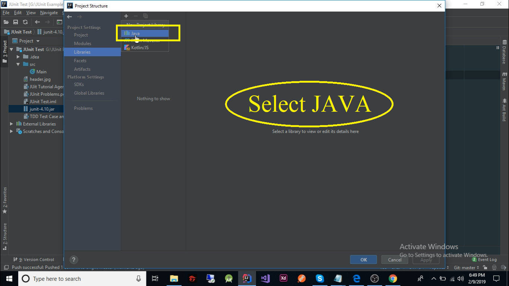
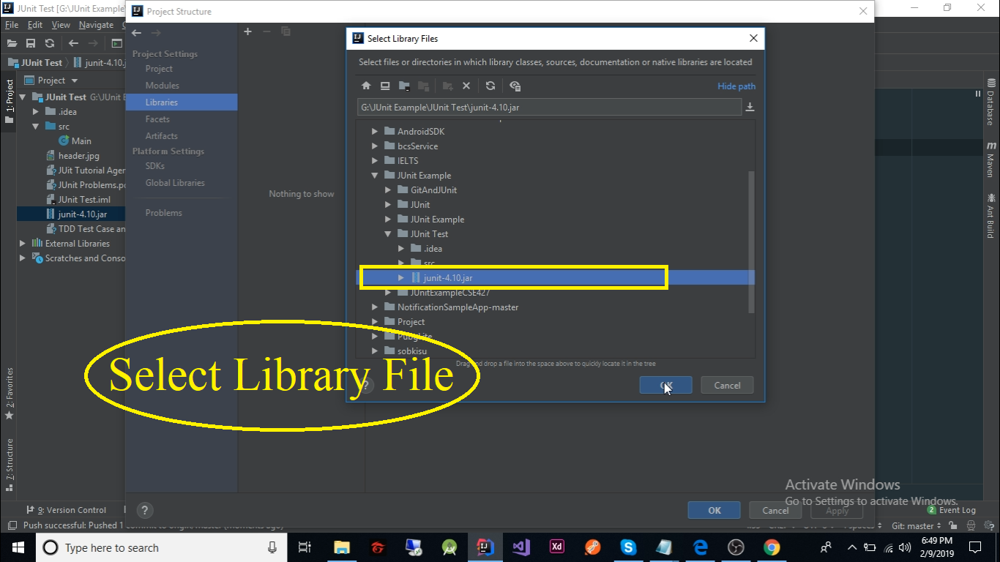
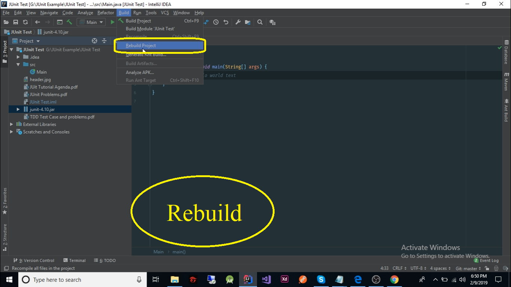

# Unit tesing for beginner using JUnit 
# `Instructor - Shaikh Shawon Arefin Shimon`

> Submitted By - Md Majedur Rahman

Within few couple of minutes we are going to learn how to test your code using JUint

# Instructions 

> 1. Install IDE  Eclipse / InteliJ IDEA

> 2. Windows OS user need to install git on System ( Unix based os doesn't need this step ) [Download From Here](https://git-scm.com/downloads)

> 3. Download JUnit.jar from  [here](https://github.com/MajedurRahmanMmr/JUint-Test/raw/master/junit-4.10.jar)

> 4. clone this repository

      git clone git@github.com:MajedurRahmanMmr/JUint-Test.git
      
> 5. Open folder with your IDE. `In this tutorial I will use InteliJ IDEA`

> 6. Follow the [video](https://www.youtube.com)

# Shortcuts 

> [Initial Project](https://github.com/MajedurRahmanMmr/JUint-Test/tree/1dcae047263782f0a19ec9bd2ab4d8475e153a03)

> [After Added JUnit Library](https://github.com/MajedurRahmanMmr/JUint-Test/tree/72a985511e550f87c5ccedd63f75de83456a4b11)

> [After Added JUnit Library](https://github.com/MajedurRahmanMmr/JUint-Test/tree/72a985511e550f87c5ccedd63f75de83456a4b11)

> [End Of Basic Understanding Of Unit test and Start of Problem 1](https://github.com/MajedurRahmanMmr/JUint-Test/tree/6503b96b3abae70d81604c0101fb0e4b08be9bcd)

> [End Of Basic Problem 1 and Start of Problem 2](https://github.com/MajedurRahmanMmr/JUint-Test/tree/7c23bc47bf277b125d319305eb5c1471965cfec1)

> [End Of Basic Problem 2](https://github.com/MajedurRahmanMmr/JUint-Test/tree/ff468711f2c7844a365a31af497c5fccf21e8815)

# `Those who are facing problem installing JUnit Library into project follow these instructions`

